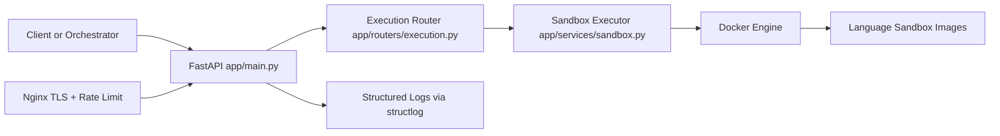

# Coding Environment Service

Secure, stateless code execution service for proctored coding flows.

## Overview

Coding Environment Service executes candidate code inside isolated Docker sandboxes and returns runtime results in real time. The current implementation is execution-focused and does not persist users, sessions, or submissions.

## Current Service Mode

- Runtime mode: stateless executor
- Primary responsibility: compile/run code safely per request
- Persistence: not used in active request path
- Auth/submission/question APIs: deprecated in active app and return `410 Gone`

## Core Capabilities

- Multi-language execution routing by language key
- Sandbox resource controls (CPU, memory, timeout, output limits)
- Security hardening (no network, reduced capabilities, seccomp restrictions)
- Request-level observability with structured logs and request IDs
- Optional internal execution endpoint with shared-secret verification
- Optional local fallback execution for Python/JavaScript when Docker is unavailable

## Architecture



## Request Lifecycle

1. Client calls `POST /api/v1/execute/run`.
2. FastAPI validates payload with Pydantic schema.
3. Router validates language and input size constraints.
4. Executor selects language config and prepares temporary workspace.
5. If needed, compile stage runs in sandbox container.
6. Program runs in isolated container with strict limits.
7. Stdout/stderr are captured, truncated, and returned.
8. Response includes `X-Request-ID` for traceability.

## Repository Structure

```text
Coding_Environment_Service/
|- app/
|  |- main.py                    # FastAPI app bootstrap and middleware
|  |- config.py                  # Environment-driven settings
|  |- routers/
|  |  |- execution.py            # Active execution endpoints
|  |  |- questions.py            # Legacy, not mounted in app
|  |- services/
|  |  |- sandbox.py              # Docker sandbox orchestration
|  |  |- logger.py               # Structured logging and legacy audit sink
|  |  |- testcase.py             # Test-case evaluator utility (legacy/optional)
|  |  |- question_store.py       # Question JSON loader (legacy/optional)
|- docker/
|  |- Dockerfile.api
|  |- Dockerfile.worker
|  |- build_sandboxes.sh
|  |- sandbox/*.Dockerfile       # python/nodejs/java/cpp/go images
|- docker-compose.yml            # API + worker + redis + postgres + nginx + flower
|- nginx.conf                    # TLS reverse proxy and rate limiting
|- migrations/001_initial.py     # Legacy persistence schema
```

## API Endpoints

### Active

- `POST /api/v1/execute/run`
- `POST /api/v1/execute/internal/run`
- `GET /health`

### Deprecated (returns `410 Gone`)

- `POST /api/v1/auth/login`
- `POST /api/v1/submissions`
- `POST /api/v1/questions`

## Execution API Contract

### Request

`POST /api/v1/execute/run`

```json
{
  "question_id": "optional-any",
  "language": "python",
  "source_code": "print(input())",
  "stdin": "hello"
}
```

### Response

```json
{
  "stdout": "hello\n",
  "stderr": "",
  "exit_code": 0,
  "execution_time_ms": 12,
  "memory_used_kb": null,
  "timed_out": false
}
```

## Supported Languages

Configured in runtime:

- `python`
- `javascript`
- `java`
- `cpp`
- `go`
- `rust`

Note: Sandbox build scripts currently ship images for Python, Node.js, Java, C++, and Go. Rust is configured in code but its Dockerfile/image build step is not present in `docker/sandbox` and `docker/build_sandboxes.sh`.

## Security Controls

Sandbox runtime in `app/services/sandbox.py` enforces:

- Network isolation via `--network none`
- Non-root execution (`uid:gid 1000:1000`)
- Read-only root filesystem
- Dropped Linux capabilities (`cap_drop=[ALL]`)
- `no-new-privileges` security option
- Restricted seccomp profile for dangerous syscalls
- Memory and CPU quotas
- File descriptor and output limits
- Timeout kill with buffer window

## Configuration

Primary configuration is in `app/config.py` via environment variables.

| Variable | Default | Purpose |
|---|---|---|
| `ENVIRONMENT` | `development` | Runtime mode and docs exposure |
| `ALLOWED_ORIGINS` | `http://localhost:3000` | CORS allowlist |
| `ALLOWED_HOSTS` | `*` | Trusted host allowlist in production |
| `MAX_EXECUTION_TIME_SECONDS` | `10` | Per-run execution timeout |
| `MAX_MEMORY_MB` | `256` | Per-run memory ceiling |
| `MAX_OUTPUT_BYTES` | `65536` | Output truncation limit |
| `SANDBOX_IMAGE_PREFIX` | `proctor-sandbox` | Sandbox image naming prefix |
| `DOCKER_NETWORK` | `none` | Container network mode |
| `OBSERVE_INTERNAL_SECRET` | empty | Optional shared secret for `/internal/run` |

Compose-level variables also include DB/Redis/Celery settings for legacy and horizontal infrastructure paths.

## Local Development

### 1. Install dependencies

```bash
pip install -r requirements.txt
```

### 2. Build sandbox images

```bash
bash docker/build_sandboxes.sh
```

### 3. Run API locally

```bash
uvicorn app.main:app --host 0.0.0.0 --port 8000 --reload
```

### 4. Verify health

```bash
curl http://localhost:8000/health
```

## Docker Deployment

```bash
docker compose up -d --build
```

`docker-compose.yml` includes:

- `api` (FastAPI service)
- `worker` (Celery worker image; currently references `app.workers.celery_app`)
- `flower` (Celery monitoring)
- `postgres` and `redis`
- `nginx` reverse proxy with TLS and rate limiting

## Environment Verification (Required)

You must verify this service has a valid `.env` before startup.

```powershell
Test-Path "Coding_Environment_Service/.env"
Select-String -Path "Coding_Environment_Service/.env" -Pattern "SECRET_KEY|DATABASE_URL|REDIS_URL"
```

If the file is missing, create it from `Coding_Environment_Service/.env.example` and populate real values.

## Repository Structure (Workspace Context)

```text
observe-github/
|- Coding_Environment_Service/  <-- current service
|- Web_Server/
|- Core_Backend_Services/
|  |- JIT_Generator_Service/
|  |- LLM_Morphing_Service/
|- Rendering_service/
|  |- report_agent/
|- Report_Generation_service/
|- EXE-Application/
|- observe/
```

