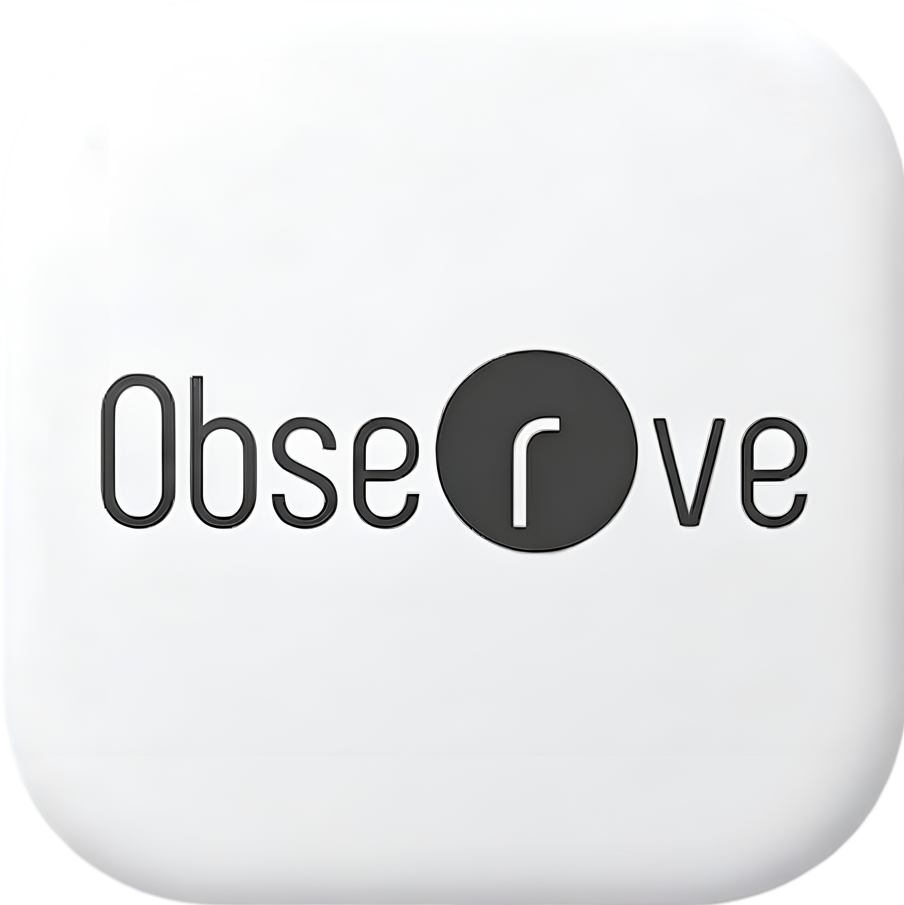

<p align="center">
   
</p>


# AI PROCTORING AND EXAMINATION PLATFORM WORKSPACE

Central monorepo for a proctored assessment platform with web and desktop clients, adaptive test generation, code execution sandboxing, report rendering, and report publishing.

## Repository Overview

This workspace contains:

- Candidate/Admin/Superadmin web frontend (`observe`)
- Secure Windows proctoring desktop client (`EXE-Application`)
- Core business API (`Web_Server`)
- Isolated code execution runtime (`Coding_Environment_Service`)
- Adaptive question generation (`JIT_Generator_Service`)
- LLM question morphing (`LLM_Morphing_Service`)
- Report rendering engine (`Rendering_service/report_agent`)
- Report generation and persistence API (`Report_Generation_service`)

## Top-Level Folder Guide

### `Web_Server/`
Primary FastAPI backend for platform business logic.

What it handles:
- Authentication (candidate/admin/superadmin)
- Candidate onboarding and profile
- Exam authoring (drives, sections, questions)
- Registration and launch-code workflow
- Attempt/answer storage and scoring
- Result publication and report link access
- Supabase file/storage operations

Key role in architecture:
- Acts as the central API gateway and source of truth for most platform workflows.

### `observe/`
React + Vite frontend for public pages and role-based dashboards.

What it handles:
- Marketing/public pages
- Candidate login/onboarding/dashboard
- Admin dashboard (exam management + results)
- Superadmin dashboard (organizations/users)

Key role in architecture:
- Main web client consuming `Web_Server` APIs.

### `EXE-Application/`
Windows desktop proctoring app (PyQt6).

What it handles:
- Full-screen exam flow with secure UI transitions
- Runtime hardening (lockdown, monitoring, anti-tamper checks)
- Audio/video/process telemetry capture
- Signed evidence and telemetry upload
- Exam API integration via HMAC-signed requests

Key role in architecture:
- High-trust proctoring client for exam runtime integrity.

### `Coding_Environment_Service/`
FastAPI service for secure, isolated code execution.

What it handles:
- Compile/run in Docker sandboxes
- Resource constraints (time/memory/output)
- Language-specific execution routing
- Optional internal secret-protected endpoint

Key role in architecture:
- Executes candidate coding answers safely outside the main backend.

### `Core_Backend_Services/JIT_Generator_Service/`
Adaptive assessment generation engine.

What it handles:
- Session start for adaptive sections
- LLM-based question generation
- Answer evaluation (objective + subjective/coding assisted)
- Difficulty progression (theta-style adaptation)
- Final JIT report generation

Key role in architecture:
- Powers dynamic JIT exam sections and personalized question flow.

### `Core_Backend_Services/LLM_Morphing_Service/`
Question-variant generation service (LangGraph-based).

What it handles:
- MCQ and typed question morphing
- Coding question transformation strategies
- Validation/retry/dedup pipeline
- Internal registration-time batch processing

Key role in architecture:
- Produces semantically equivalent but varied question sets.

### `Rendering_service/report_agent/`
HTML report rendering and summary service.

What it handles:
- Parse/normalize report payloads
- Generate AI summary (Groq with fallback logic)
- Render JIT/morphing report templates
- Serve evidence in paginated form

Key role in architecture:
- Converts report JSON into browser/PDF-friendly visual reports.

### `Report_Generation_service/`
Report assembly and publishing API.

What it handles:
- Build canonical report from DB + storage artifacts
- Aggregate attempts, answers, JIT, morphing, coding, proctoring evidence
- Upload report JSON/PDF artifacts to storage
- Build rendering URLs
- Upsert report metadata into exam result records

Key role in architecture:
- Final orchestrator for report generation and artifact persistence.

### Utility/Docs Files

- `ENV_INSTALLATION_FROM_GDRIVE.md`: How to place `.env` files from Google Drive into each service.
- `SECURITY_ANALYSIS_FULL.md`: Full secret-handling and exposure analysis.

## Service Communication Map

## Core Interaction Diagram


## Communication by Workflow

### 1. Candidate Web Exam Lifecycle
1. `observe` calls `Web_Server` for auth/onboarding/exam discovery.
2. Candidate registers and receives launch code via `Web_Server`.
3. Candidate submits answers to `Web_Server`.
4. For adaptive/morphing/coding flows, `Web_Server` coordinates with:
   - `JIT_Generator_Service`
   - `LLM_Morphing_Service`
   - `Coding_Environment_Service`
5. Results are stored and surfaced back to frontend dashboards.

### 2. Desktop Proctored Exam Lifecycle
1. `EXE-Application` authenticates against backend endpoints.
2. EXE starts proctoring modules (vision/audio/process/integrity).
3. EXE sends signed telemetry/evidence to backend APIs.
4. Backend persists artifacts and exam progress.
5. Final submission triggers result/report pipeline.

### 3. Report Publishing Flow
1. `Web_Server` admin/candidate flow initiates report access.
2. `Report_Generation_service` builds canonical report from DB + storage.
3. Report artifacts (JSON/PDF placeholders) are uploaded.
4. `Rendering_service` is used for HTML report rendering and preview links.
5. Rendered URL or signed artifact links are returned to consumers.

## Data and Integration Boundaries

### Shared Data Stores
- PostgreSQL (primary relational domain data) Deployed in Neon DB 
- Supabase Storage (documents, evidence, report artifacts)

### LLM Providers
- Groq (primary for generation/summarization)
- Gemini (fallback in selected services)

### Security Model (Cross-Service)
- Env-driven configuration for secrets/URLs
- JWT-based auth for web roles
- HMAC request signing for EXE critical operations
- Internal service tokens for protected internal endpoints

## Typical Local Ports (Development)

Common defaults used in docs/code:

- `Web_Server`: `8000`
- `JIT_Generator_Service`: `8001` (API mode), `8002` (standalone mode)
- `LLM_Morphing_Service`: commonly `8000` (public API) and `8001` (internal server) when run standalone in its folder
- `Rendering_service/report_agent`: `5050` (unified renderer)
- `Report_Generation_service`: `8010`
- `observe` (Vite): `5173` (default Vite dev)

Adjust ports as needed when running multiple services together.

## Environment and Setup Notes

- `.env` files are service-local and should not be committed.
- `.env.example` is available per service as template.
- Use `ENV_INSTALLATION_FROM_GDRIVE.md` for credential placement workflow.

## Suggested Bring-Up Order (Dev)

1. Start `Web_Server` dependencies (DB/storage connectivity ready).
2. Start `Coding_Environment_Service` for coding execution.
3. Start `JIT_Generator_Service` and `LLM_Morphing_Service` for adaptive/morphing paths.
4. Start `Rendering_service/report_agent`.
5. Start `Report_Generation_service`.
6. Start `observe` frontend.
7. Start `EXE-Application` only when testing desktop proctoring flow.

## Folder Tree (High Level)

```text
virtusa-github/
|- Web_Server/
|- observe/
|- EXE-Application/
|- Coding_Environment_Service/
|- Core_Backend_Services/
|  |- JIT_Generator_Service/
|  |- LLM_Morphing_Service/
|- Rendering_service/
|  |- report_agent/
|- Report_Generation_service/
|- ENV_INSTALLATION_FROM_GDRIVE.md
|- SECURITY_ANALYSIS_FULL.md
```

## Environment Verification (Required)

Before starting any service, verify `.env` exists in each service folder:

```powershell
Test-Path "Web_Server/.env"
Test-Path "Coding_Environment_Service/.env"
Test-Path "Core_Backend_Services/JIT_Generator_Service/.env"
Test-Path "Core_Backend_Services/LLM_Morphing_Service/.env"
Test-Path "Rendering_service/report_agent/.env"
Test-Path "Report_Generation_service/.env"
Test-Path "EXE-Application/.env"
```

If any command returns `False`, copy from `.env.example` and set real values before running.


## EXE - APPLICATION LINK

- Download EXE: [Google Drive Link](https://drive.google.com/file/d/1t6lMF2YBEF8WOVlN90k4zm10z7LF2Np5/view?usp=drive_link)


## DEMO VIDEO

[click here](https://drive.google.com/file/d/1xja1Q5mrVP9DZKmAbGbMpsCun8lYYzPz/view?usp=sharing)