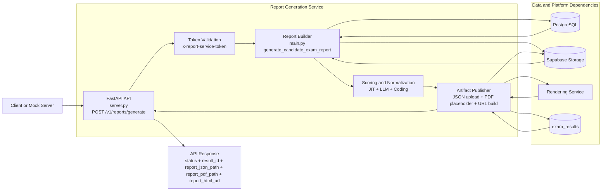

# Report Generation Service

Generates candidate exam report artifacts (JSON, PDF placeholder, rendering URL) from candidate email + launch code, and persists output links to exam results.

## Table of Contents

- [Overview](#overview)
- [About the Service](#about-the-service)
- [Process Flow](#process-flow)
- [Architecture Diagram](#architecture-diagram)
- [Built With](#built-with)
- [Service Overview](#service-overview)
- [Installation](#installation)
- [Environment Variables](#environment-variables)
- [Sample Request Response](#sample-request-response)

## Overview

The Report Generation Service is implemented in [Report_Generation_service/main.py](Report_Generation_service/main.py) and [Report_Generation_service/server.py](Report_Generation_service/server.py).

It does two main jobs:

- Builds a complete candidate exam report payload by querying platform data (candidate, launch, exam, attempts, section/question/answer activity, JIT events, LLM variants, coding submissions, and proctoring artifacts from Supabase Storage).
- Exposes an API to generate and persist report artifacts:
  - report JSON in Supabase
  - report PDF placeholder in Supabase
  - report HTML preview URL (through Rendering Service)
  - upserted `exam_results` row with report paths/URL

## About the Service

This service is a backend orchestration layer for report publishing.

- Input: `email` + `launch_code`
- Internal data sources:
  - PostgreSQL (via SQLAlchemy)
  - Supabase Storage (evidence images and logs)
  - Rendering Service (optional, for HTML report URL)
- Output:
  - canonical report JSON
  - evidence manifest JSON
  - report metadata in `exam_results`

The service supports both JIT-mode and morphing-mode exam reporting, and computes normalized scoring summaries per selected attempt.

## Process Flow

1. API receives `email` and `launch_code`.
2. Service validates optional auth token (`x-report-service-token`) if configured.
3. Service resolves candidate + launch + drive from DB.
4. Service resolves exam details, sections, and attempts.
5. Service loads question/answer artifacts:
   - static questions and answers
   - JIT answer events + JIT final reports
   - LLM question variants and recomputed scores
   - coding submissions (run history + final submission)
6. Service computes per-attempt and selected-attempt score breakdown.
7. Service pulls proctoring artifacts from Supabase Storage:
   - evidence frames (signed URLs)
   - exam logs (signed URLs)
8. Service writes local JSON report and evidence manifest (CLI path behavior).
9. API flow uploads JSON + PDF artifacts to Supabase buckets.
10. API builds persistent rendering URL (or fallback direct render call).
11. API upserts `exam_results` with report paths and HTML URL.
12. API returns report identifiers and artifact locations.

## Architecture Diagram



## Built With

- Python 3
- FastAPI
- Uvicorn
- SQLAlchemy
- PostgreSQL (Neon)
- Supabase Storage REST APIs
- urllib / concurrent futures from standard library

## Service Overview

### Core files

- [Report_Generation_service/main.py](Report_Generation_service/main.py)
  - Core report assembly engine (`generate_candidate_exam_report`)
  - DB fetch and normalization logic
  - Scoring recomputation for morphed variants
  - JIT topic strength extraction
  - Proctoring evidence/log collection and signed URL attachment
  - CLI entrypoint

- [Report_Generation_service/server.py](Report_Generation_service/server.py)
  - FastAPI app and generation endpoint
  - Artifact upload to Supabase buckets
  - Rendering URL creation
  - `exam_results` upsert logic

- [Report_Generation_service/.env](Report_Generation_service/.env)
  - local runtime configuration

### API endpoints

- `GET /health`
- `POST /v1/reports/generate`

### Main data persisted by API endpoint

- `report_json_bucket` + `report_json_path`
- `report_pdf_bucket` + `report_pdf_path`
- `report_html_url`
- `result_id`, `candidate_id`, `drive_id`, `attempt_id`

## Installation

### Prerequisites

- Python 3.11+
- Access to PostgreSQL and Supabase configured in environment

### Setup

```bash
cd Report_Generation_service
python -m venv .venv
.venv\Scripts\activate
pip install fastapi uvicorn sqlalchemy psycopg2-binary
```

If your workspace already has a shared backend requirements file, you can install from that instead.

### Run API server

```bash
uvicorn server:app --host 0.0.0.0 --port 8010 --reload
```

### Run CLI generation directly

```bash
python main.py --email candidate@example.com --launch-code ABCD1234 --output candidate_exam_report.json
```

## Environment Variables

Configured in [Report_Generation_service/.env](Report_Generation_service/.env) and/or process env.

### Required

- `DATABASE_URL`
- `SUPABASE_URL`
- `SUPABASE_SERVICE_ROLE_KEY` (or `SUPABASE_KEY`)

### Service behavior

- `REPORT_SERVER_PORT` (default `8010`)
- `REPORT_SERVICE_AUTH_TOKEN` (optional; enables header validation)

### Buckets and rendering

- `REPORT_JSON_BUCKET` (default `report-json`)
- `CANDIDATE_REPORTS_BUCKET` (default `candidate-reports`)
- `RENDERING_SERVICE_URL` (used for persistent preview links)
- `REPORT_RENDERING_SERVICE_URL` (fallback alias)
- `REPORT_RENDER_VERIFY_TLS` (optional)

### Evidence/signing controls

- `EVIDENCE_BUCKET` (default `evidence-frame`)
- `EVIDENCE_MAX_ITEMS` (default `300`)
- `EVIDENCE_SIGNED_URL_EXPIRES_IN` (default `31536000`)
- `SUPABASE_SIGNED_URL_EXPIRES_IN` (default `604800`)

## Sample Request Response

### Request

`POST /v1/reports/generate`

Headers:

- `Content-Type: application/json`
- `x-report-service-token: <token>` (only when token auth is enabled)

Body:

```json
{
  "email": "candidate@example.com",
  "launch_code": "ABCD1234"
}
```

### Response

```json
{
  "status": "ok",
  "result_id": 157,
  "candidate_id": 42,
  "drive_id": 17,
  "attempt_id": 95,
  "report_json_bucket": "report-json",
  "report_json_path": "reports/candidate_example.com/abcd1234_20260330102030.json",
  "report_pdf_bucket": "candidate-reports",
  "report_pdf_path": "reports/candidate_example.com/abcd1234_20260330102030.pdf",
  "report_html_url": "https://<render-service>/preview/from-storage?bucket=report-json&path=reports/...json"
}
```

## Environment Verification (Required)

You must verify this service has a valid `.env` before startup.

```powershell
Test-Path "Report_Generation_service/.env"
Select-String -Path "Report_Generation_service/.env" -Pattern "DATABASE_URL|SUPABASE_URL|SUPABASE_SERVICE_ROLE_KEY|RENDERING_SERVICE_URL"
```

If the file is missing, create it from `Report_Generation_service/.env.example` and populate real values.

## Repository Structure (Workspace Context)

```text
observe-github/
|- Report_Generation_service/   <-- current service
|- Rendering_service/
|  |- report_agent/
|- Web_Server/
|- Coding_Environment_Service/
|- Core_Backend_Services/
|  |- JIT_Generator_Service/
|  |- LLM_Morphing_Service/
|- EXE-Application/
|- observe/
```

