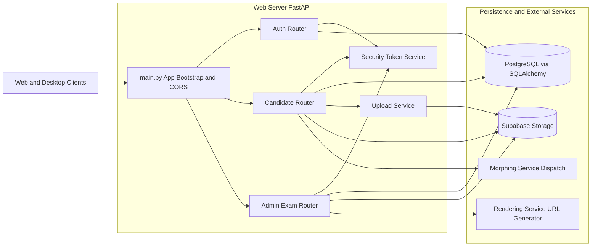

# Web Server

Backend API service for authentication, candidate onboarding, exam lifecycle management, result publishing, and report access across candidate, admin, and superadmin workflows.

## Table of Contents

- [Overview](#overview)
- [About the Service](#about-the-service)
- [Process Flow](#process-flow)
- [Database Relations](#database-relations)
- [Architecture Diagram](#architecture-diagram)
- [Built With](#built-with)
- [Service Overview](#service-overview)
- [Installation](#installation)
- [Environment Variables](#environment-variables)
- [Sample Request Response](#sample-request-response)

## Overview

The Web Server is a FastAPI application composed of modular routers for auth, candidate actions, and admin exam operations. It uses SQLAlchemy models for platform entities (users, candidates, vendors, drives, sections, questions, attempts, results, coding, JIT), integrates with Supabase Storage for file handling, and provides signed report links and rendering preview links.

Main entry and configuration are in [Web_Server/main.py](Web_Server/main.py), [Web_Server/database.py](Web_Server/database.py), and [Web_Server/models.py](Web_Server/models.py).

## About the Service

This service acts as the core business API for the assessment platform.

It supports:

- Authentication and token-based session handling for candidate, admin, and superadmin roles.
- Candidate onboarding steps (account, identity, profile, links, resume/photo uploads).
- Candidate exam discovery, registration, launch code issuance, attempt answer submission, result history, and offer download.
- Admin exam authoring and governance (exam, section, and question CRUD), result publishing, and report link generation.
- Superadmin organization and user management (create/edit/delete organizations and users).
- Notification retrieval and read status updates.

## Process Flow

1. Client authenticates through auth routes and receives an access token.
2. Candidate completes onboarding using staged profile endpoints.
3. Candidate discovers published exams and registers for selected drives.
4. System issues or regenerates launch codes for registered exams.
5. Candidate submits attempt answers; server scores and updates attempt totals.
6. Admin creates/updates exams, sections, and questions and controls publish state.
7. Result records are evaluated/published and exposed to candidate history.
8. Report links are returned either as signed PDF URLs or rendering preview URLs.
9. Superadmin manages organizations and platform-level users.

## Database Relations

The following are the primary table relationships defined in [Web_Server/models.py](Web_Server/models.py):

### Identity and organization

- users (1) -> (0..1) candidates via candidates.user_id
- users (1) -> (0..1) vendors via vendors.user_id
- users (1) -> (0..N) notifications via notifications.user_id

### Candidate profile and documents

- candidates (1) -> (0..N) candidate_identities via candidate_identities.candidate_id
- candidates (1) -> (0..N) educations via educations.candidate_id
- candidates (1) -> (0..N) skills via skills.candidate_id
- candidates (1) -> (0..N) candidate_documents via candidate_documents.candidate_id
- candidates (1) -> (0..N) candidate_links via candidate_links.candidate_id

### Exam authoring and registration

- vendors (1) -> (0..N) drives via drives.vendor_id
- drives (1) -> (0..N) exam_sections via exam_sections.drive_id
- drives (1) -> (0..N) questions via questions.drive_id
- exam_sections (1) -> (0..N) questions via questions.section_id
- drives (1) -> (0..N) drive_registrations via drive_registrations.drive_id
- candidates (1) -> (0..N) drive_registrations via drive_registrations.candidate_id
- drive_registrations has unique constraint on drive_id + candidate_id
- drive_registrations (1) -> (0..N) exam_launch_codes via exam_launch_codes.registration_id

### Attempt, answers, JIT, coding, and outcomes

- drives (1) -> (0..N) exam_attempts via exam_attempts.drive_id
- candidates (1) -> (0..N) exam_attempts via exam_attempts.candidate_id
- exam_attempts (1) -> (0..N) answers via answers.attempt_id
- questions (1) -> (0..N) answers via answers.question_id
- exam_attempts (1) -> (0..N) jit_section_sessions via jit_section_sessions.attempt_id
- exam_sections (1) -> (0..N) jit_section_sessions via jit_section_sessions.section_id
- jit_section_sessions (1) -> (0..N) jit_answer_events via jit_answer_events.jit_section_session_id
- exam_attempts (1) -> (0..N) jit_answer_events via jit_answer_events.attempt_id
- questions (1) -> (0..1) coding_questions via coding_questions.question_id (unique)
- coding_questions (1) -> (0..N) test_cases via test_cases.coding_question_id
- exam_attempts (1) -> (0..N) code_submissions via code_submissions.attempt_id
- questions (1) -> (0..N) code_submissions via code_submissions.question_id
- candidates (1) -> (0..N) code_submissions via code_submissions.candidate_id
- drives (1) -> (0..N) exam_results via exam_results.drive_id
- candidates (1) -> (0..N) exam_results via exam_results.candidate_id
- exam_attempts (1) -> (0..1) exam_results via unique exam_results.attempt_id
- exam_results has unique constraint on drive_id + candidate_id and on attempt_id
- drives (1) -> (0..N) offers via offers.drive_id
- candidates (1) -> (0..N) offers via offers.candidate_id

## Architecture Diagram



## Built With

- FastAPI
- SQLAlchemy ORM
- PostgreSQL
- Pydantic
- Passlib bcrypt
- Custom HMAC JWT handling
- Supabase Python client
- Python dotenv

## Service Overview

### Application structure

- [Web_Server/main.py](Web_Server/main.py): FastAPI app creation, CORS setup, router wiring.
- [Web_Server/database.py](Web_Server/database.py): DB engine/session/base setup.
- [Web_Server/models.py](Web_Server/models.py): Full relational domain model.
- [Web_Server/security.py](Web_Server/security.py): access token create/decode.
- [Web_Server/storage.py](Web_Server/storage.py): Supabase client bootstrap.
- [Web_Server/services/upload_service.py](Web_Server/services/upload_service.py): bucket upload helper.

### Routers

- [Web_Server/routers/auth.py](Web_Server/routers/auth.py)
  - candidate register/login/me/change-password
  - admin login/profile/general settings
  - superadmin login and organization/user governance
  - notifications endpoints

- [Web_Server/routers/candidate.py](Web_Server/routers/candidate.py)
  - onboarding step endpoints
  - profile and photo updates
  - attempt answer submission and scoring
  - exam discover/register/unregister/launch-code
  - upcoming exams and result history
  - offer download

- [Web_Server/routers/exam.py](Web_Server/routers/exam.py)
  - exam CRUD
  - section CRUD
  - question CRUD
  - admin results listing and publishing
  - report preview/download link generation

## Installation

### Prerequisites

- Python 3.10+
- PostgreSQL database reachable by DATABASE_URL
- Supabase project credentials

### Setup

```bash
cd Web_Server
python -m venv .venv
.venv\Scripts\activate
pip install fastapi uvicorn sqlalchemy python-dotenv passlib[bcrypt] supabase
```

### Run the service

```bash
uvicorn main:app --host 0.0.0.0 --port 8000 --reload
```

## Environment Variables

The following are used directly by code in this service.

### Database and storage

- DATABASE_URL (required): SQLAlchemy connection URL.
- SUPABASE_URL (required): Supabase project URL.
- SUPABASE_KEY (required by current storage client): API key used by Supabase SDK.

### Token/auth

- JWT_SECRET_KEY (optional but recommended): secret for custom JWT HMAC signing.
- SUPERADMIN_EMAIL (optional): superadmin login email.
- SUPERADMIN_PASSWORD (optional): superadmin login password.

### Candidate and exam workflow controls

- MORPHING_SERVICE_URL (optional): internal morphing processor endpoint.
- MORPHING_SERVICE_TOKEN (optional): internal token for morphing dispatch.
- MORPHING_SERVICE_TIMEOUT_SECONDS (optional): request timeout.
- MORPHING_SERVICE_ENABLED (optional): feature toggle.
- EXAM_LAUNCH_CODE_TTL_MINUTES (optional): launch code expiry.
- EXAM_LAUNCH_CODE_LENGTH (optional): generated launch code length.
- REPORT_LINK_TTL_SECONDS (optional): signed report link validity.

### Report preview linking

- RENDERING_SERVICE_URL (optional): rendering service base URL.
- REPORT_RENDERING_SERVICE_URL (optional): alternate variable for same purpose.

## Sample Request Response

### Request

POST /auth/login

Body:

```json
{
  "email": "candidate@example.com",
  "password": "candidate-password"
}
```

### Response

```json
{
  "message": "Login successful",
  "candidate_id": 101,
  "onboarding_step": 4,
  "email": "candidate@example.com",
  "access_token": "<jwt-token>",
  "token_type": "bearer"
}
```

Additional common admin endpoint example:

POST /admin/exams

```json
{
  "title": "Backend Engineer Assessment",
  "exam_type": "Technical",
  "duration_minutes": 90,
  "max_attempts": 2,
  "description": "Core backend and SQL skills",
  "generation_mode": "static",
  "eligibility": "2+ years",
  "start_date": "2026-04-01",
  "end_date": "2026-04-15",
  "exam_date": "2026-04-10T10:00:00",
  "max_marks": 100,
  "is_published": false,
  "key_topics": ["python", "sql"],
  "specializations": ["backend"]
}
```

## Environment Verification (Required)

You must verify this service has a valid `.env` before startup.

```powershell
Test-Path "Web_Server/.env"
Select-String -Path "Web_Server/.env" -Pattern "DATABASE_URL|SUPABASE_URL|SUPABASE_KEY"
```

If the file is missing, create it from `Web_Server/.env.example` and populate real values.

## Repository Structure (Workspace Context)

```text
virtusa-github/
|- Web_Server/                  <-- current service
|- Coding_Environment_Service/
|- Core_Backend_Services/
|  |- JIT_Generator_Service/
|  |- LLM_Morphing_Service/
|- Rendering_service/
|  |- report_agent/
|- Report_Generation_service/
|- EXE-Application/
|- observe/
```
